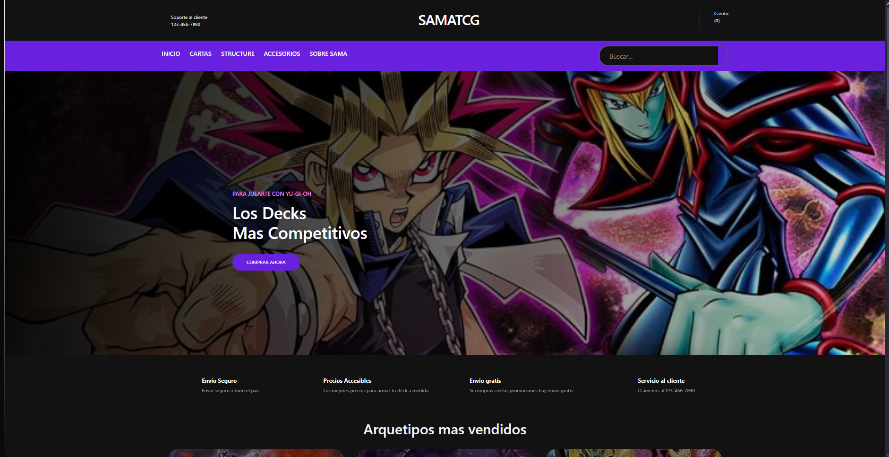
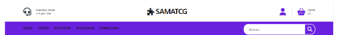
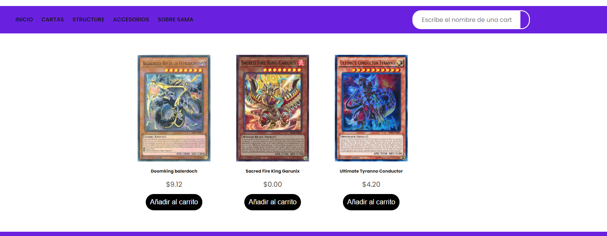
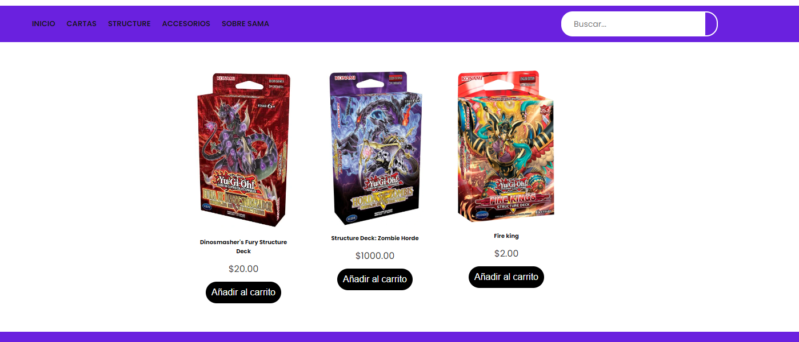
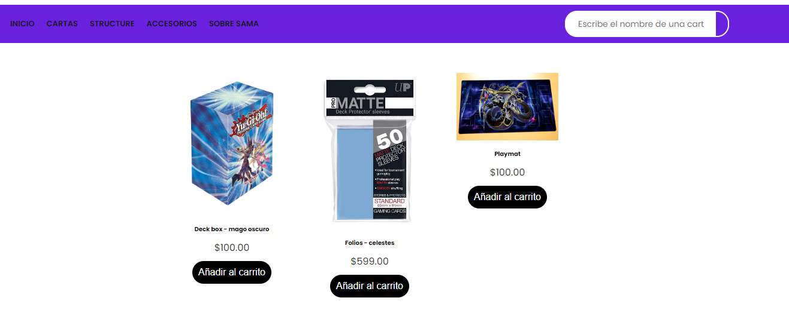
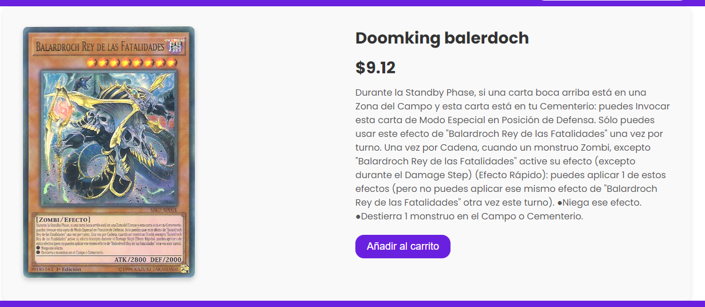
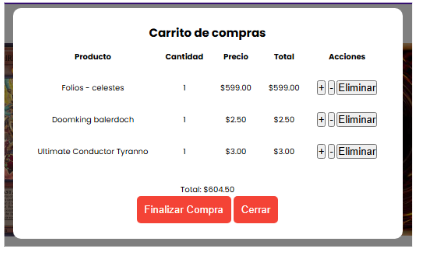

<h1>SamaTCG Proyecto M&S 7°3°</h1>
 
 
 

Nosotros a través de este medio presentamos Samatcg, un proyecto que desarrolló el grupo de analistas y programadores. Con el objetivo de desarrollar una ecommerce que sea capaz de:
<ul>
<li>optimizar la gestión de inventarios </li>
<li>Registro e inicio de sesion de usuarios </li>
<li>Que los usuarios puedan navegar de forma amigable por el sistema</li>
<li>También pueden realizar compras de los productos que quieran.</li>
</ul>	

Samatcg es una plataforma de comercio electrónico especializada en la compra y venta de cartas de Yu-Gi-Oh!. Desarrollada a medida para el dueño del sistema, Sama, la plataforma tiene como objetivo ofrecer una solución integral que permita gestionar su inventario de productos, facilitar las compras a los usuarios y optimizar el proceso de venta. ¿Cómo lo hicimos ? Utilizando tecnologías como HTML, CSS, PHP y JavaScript, Samatcg no solo cumple con los requisitos iniciales del cliente, sino que también incluye funcionalidades adicionales para mejorar la experiencia de compra.

El objetivo principal de Samatcg es simplificar y agilizar el proceso de compra y venta de cartas coleccionables, eliminando la necesidad de que los compradores interactúen manualmente con cada vendedor o se desplacen físicamente a realizar sus compras. Ahora, con nuestra plataforma, los usuarios pueden realizar sus transacciones de manera digital y segura, mientras que los vendedores pueden enfocarse únicamente en gestionar su inventario y coordinar los envíos, sin tener que preocuparse por los aspectos logísticos de la venta.
Para nosotros, el futuro de Samatcg va más allá de ser una simple plataforma de comercio electrónico. Nuestra visión es expandir la comunidad de Samatcg, creando un espacio donde los usuarios no solo compren y vendan cartas, sino también intercambien experiencias, conocimientos y pasiones relacionadas con el mundo de Yu-Gi-Oh!. Creemos que, con el tiempo, Samatcg puede convertirse en el referente global para todos los entusiastas de las cartas coleccionables, brindando un servicio de calidad y accesibilidad a nivel internacional.

<h4>Este es el inicio de la pagina</h4>

¿Qué encontrarás aquí?
La página principal es el lugar donde comienza la experiencia en SamaTCG.
<li>Explorar productos destacados: Una selección de artículos populares o nuevos.</li>
<li>Acceder al menú principal: Ubicado en la parte superior, te permitirá navegar fácilmente por todas las secciones de la tienda.</li>

Cómo navegar desde la página principal:
<ul>Mira los productos destacados para descubrir opciones recomendadas.</ul>
<ul>Accede al menú para visitar las diferentes secciones: Cartas, Accesorios o Estructuras.</ul>
  
<h5>Sección de cartas</h5>  

<h5>Sección de structure</h5>  

<h5>Sección de accesorios</h5>  

en las 3 secciones se pueden ver todos los productos que tenga SamaTCG ofreciendo, al hacer click en ellos mostrara una mayor descripcion del mismo:

ademas de eso los usuarios pueden sumar productos a sus carritos, pueden tener varios productos al mismo tiempo. Solo tienen que sumar varios productos al carrito y en el logo de carrito hacer click  y se mostrara asi donde se podra realizar la compra:

Ademas para Sama realizamos un apartado donde puede editar, subir, bajar y ver sus productos.

>    - Chamorro Santiago
>    - Diaz Agustin
>    - Gonzalez Mariano 
